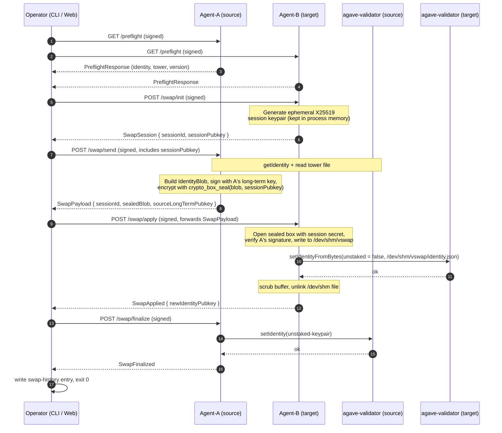

# Architecture

## Components

| Component | Package | Process | Trust role |
| --- | --- | --- | --- |
| Source agent (Agent-A) | `@vswap/agent` | one daemon per validator host (the role is per-swap, not per-host — every agent can be either) | Reads the staked identity + tower from `agave-validator`'s admin RPC; signs and seals the `IdentityBlob` against the target's session pubkey. |
| Target agent (Agent-B) | `@vswap/agent` | same daemon, opposite role for a given swap | Generates the X25519 session keypair, decrypts the blob into `/dev/shm`, calls `setIdentityFromBytes`, scrubs and unlinks. |
| Operator CLI | `@vswap/cli` | invoked from operator workstation | Pairs agents (TOFU), runs preflight, orchestrates the swap, handles rollback. Forwards opaque blobs between agents — never sees plaintext identity material. |
| Operator web | `@vswap/web` | hosted sandbox + self-hostable Next.js app | Public deploy runs a disposable sealed-box sandbox. Production live mode has the same role as the CLI but must be self-hosted with `VSWAP_ENABLE_LIVE_PROXY=1`. |

## Wire format

Every authenticated request and reply (HTTP body, WebSocket frame) is
the same `EnvelopeV1` shape:

```
EnvelopeV1 {
  protocolVersion : "1.0.0"          // exact-match
  senderLongTermPubkey : Uint8Array(32)  // Ed25519 pubkey
  nonce : Uint8Array(24)             // libsodium randombytes_buf
  timestamp : i64                    // Unix ms
  payload : Uint8Array               // msgpack(InnerMessage)
  signature : Uint8Array(64)         // ed25519_detached(sender, payload || nonce || timestamp || protocolVersion)
}
```

The envelope is itself msgpack-encoded. HTTP content type:
`application/vswap+msgpack`. Signature verification uses
`crypto_sign_verify_detached` and runs *before* zod parses the payload,
so tampered bytes never reach decoder logic.

## End-to-end swap flow



The `IdentityBlob` is the only message that ever contains plaintext
key material. It is constructed inside Agent-A and decrypted only
inside Agent-B; the bytes the orchestrator forwards on its behalf are
opaque sealed-box ciphertext.

## Failure handling

- **Source-side failure (steps 5–6 above).** No `setIdentity` has been
  called yet on either side. The CLI exits non-zero and instructs the
  operator to retry; the source validator is still staked.
- **Target-side decrypt or write failure (step 8).** Same — the source
  is still staked, target reverts to unstaked. CLI exits 1.
- **Target accepted but source `setIdentity(unstaked)` failed (step
  10).** Both validators temporarily think they are staked. CLI
  detects this from the missing `SwapFinalized`, runs `vswap rollback
  --to backup` automatically (which calls `setIdentity(unstaked)` on
  the target), and exits 6 if rollback itself fails. The default
  rollback uses the all-zero session id; pass `--session-id` to thread
  a specific id through the audit log.

## Pairing flow

Pairing is the only path that bypasses the "must be in `peers.json`"
gate, because peers do not know each other yet.

1. Operator runs `vswap pair --agent host:port --label primary`.
2. CLI POSTs a signed `PairRequest` containing the operator's
   long-term pubkey and a human label.
3. Agent generates / returns its own long-term pubkey in
   `PairResponse`.
4. CLI computes a SHA-256 fingerprint over the raw 32-byte agent
   pubkey, formatted as 8 groups of 4 uppercase hex separated by
   colons (TOFU style), and shows it to the operator.
5. Operator either types `yes` (accept) or pastes the fingerprint
   they confirmed out-of-band. `--yes` skips the prompt for CI.
6. CLI persists the peer to `~/.vswap/peers.json`. Subsequent
   commands are gated on the agent matching the persisted pubkey.

## Storage layout on the agent host

```
/etc/vswap/
├── config.yml                # listen.host, listen.port, paths.tls.*
├── ca.crt                    # operator CA
├── agent.crt agent.key       # mTLS server cert
└── identity-handle.yml       # validator admin-RPC socket path

/var/lib/vswap/
├── peers.json                # paired operator pubkeys (label, pubkey, addedAt)
├── nonces.log                # append-only anti-replay log
└── swap.lock                 # acquired with O_EXCL, released in finally

/dev/shm/vswap/               # tmpfs
└── <sessionId>.json          # decrypted identity, lifespan = setIdentity call
```

Permissions are enforced at startup: the agent refuses to read a TLS
key that is group- or world-readable, and refuses to write under
`/var/lib/vswap` if it isn't owned by the agent's UID.

## Why CLI **and** web?

- **CLI** is the right surface for routine work, CI integration,
  Ansible / Salt runbooks, and any operator who wants to stay in their
  shell.
- **Web** is for operators-on-call: at 03:00 the laptop is closed and
  the on-call person is on a phone. Being able to confirm preflight
  and trigger rollback from the same dashboard the team monitors saves
  minutes that matter.

Both surfaces speak the same protocol against the same agents. In live
web mode, the Next.js API route handles mTLS server-side after the
operator unlocks a `vswap export --for-web` bundle in the browser.
